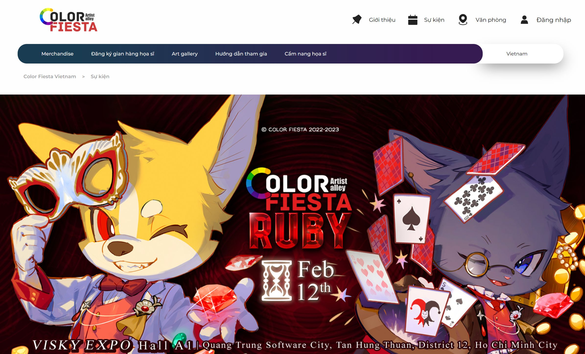

<a name="readme-top"></a>

[![Contributors][contributors-shield]][contributors-url]
[![Forks][forks-shield]][forks-url]
[![Stargazers][stars-shield]][stars-url]
[![Issues][issues-shield]][issues-url]
[![MIT License][license-shield]][license-url]
[![LinkedIn][linkedin-shield]][linkedin-url]

<!-- PROJECT LOGO -->

<br />
<div align="center">
  <!-- <a href="https://github.com/notabota/traffix">
    
  </a> -->

<h3 align="center">Color Fiesta </h3>

<p align="center">
    A website built for the annual anime festival - Color Fiesta 
    <br />
    <br />
    <a href="https://github.com/notabota/Optimized-Detectron2-for-high-altitude-traffic-monitoring-camera">View Demo</a>
    ·
    <a href="https://github.com/notabota/Optimized-Detectron2-for-high-altitude-traffic-monitoring-camera/issues">Report Bug</a>
    ·
    <a href="https://github.com/notabota/Optimized-Detectron2-for-high-altitude-traffic-monitoring-camera/issues">Request Feature</a>
  </p>
</div>



<!-- TABLE OF CONTENTS -->

<details>
  <summary>Table of Contents</summary>
  <ol>
    <li>
      <a href="#about-the-project">About The Project</a>
    </li>
    <li>
      <a href="#details">Details</a>
    </li>
    <li>
        <a href="#getting-started">Getting Started</a>
    </li>
    <li>
        <a href="#contributing">Contributing</a>
    </li>
    <li><a href="#contact">Contact</a></li>
  </ol>
</details>

<!-- ABOUT THE PROJECT -->

## About The Project

This projects serve as a design structure for the Color Fiesta festival website, which include dashboard, timeline, news, notifications and ticket booking system.

<!-- Use the `BLANK_README.md` to get started. -->

<p style="text-align: right;"><a href="#readme-top">back to top</a></p>

### Built With


[](https://astro.build)
[](https://codesandbox.io/)
[](https://react.dev/)
[](https://www.postgresql.org/)

<p style="text-align: right;"><a href="#readme-top">back to top</a></p>

<!-- GETTING STARTED -->

## Getting Started

### Prerequisites

Install dependancies

```sh
npm install
```

### Running

```sh
npm run dev
```

<p style="text-align: right;"><a href="#readme-top">back to top</a></p>

<!-- ROADMAP -->

## Roadmap

- [X]  UI / UX
- [X]  Architecture desgn
- [ ]  Ticket booking system
- [ ]  Connect to the local database
- [ ]  Create admin pages for management

See the [open issues](https://github.com/notabota/traffix/issues) for a full list of proposed features (and known issues).

<p style="text-align: right;"><a href="#readme-top">back to top</a></p>

<!-- CONTRIBUTING -->

## Contributing

Contributions are what make the open source community such an amazing place to learn, inspire, and create. Any
contributions you make are **greatly appreciated**.

If you have a suggestion that would make this better, please fork the repo and create a pull request. You can also
simply open an issue with the tag "enhancement".

1. Fork the Project
2. Create your Feature Branch (`git checkout -b feature/AmazingFeature`)
3. Commit your Changes (`git commit -m 'Add some AmazingFeature'`)
4. Push to the Branch (`git push origin feature/AmazingFeature`)
5. Open a Pull Request

<p style="text-align: right;"><a href="#readme-top">back to top</a></p>

## Contact

Nguyễn Nguyên Vũ

* [![Gmail][gmail]]() - **nnv2205owo@gmail.com**
* [![Facebook][facebook]](https://www.facebook.com/nnv2205owo/) - **facebook.com/nnv2205owo**
* [![LinkedIn][linkedin]](https://www.linkedin.com/in/nnv2205owo/) - **linkedin.com/in/nnv2205owo**
* [![Upwork][upwork]](https://www.upwork.com/freelancers/~012078434f80806fe1) - **upwork.com/freelancers/~
  012078434f80806fe1**

Project Link: [https://github.com/notabota/traffix](https://github.com/notabota/traffix)

<p style="text-align: right;"><a href="#readme-top">back to top</a></p

<!-- MARKDOWN LINKS & IMAGES -->

[Firebase]: https://img.shields.io/badge/firebase-%23039BE5.svg?style=for-the-badge&logo=firebase

[Firebase-url]: https://firebase.google.com/

[contributors-shield]: https://img.shields.io/github/contributors/othneildrew/Best-README-Template.svg?style=for-the-badge

[contributors-url]: https://github.com/notabota/traffix/graphs/contributors

[forks-shield]: https://img.shields.io/github/forks/othneildrew/Best-README-Template.svg?style=for-the-badge

[forks-url]: https://github.com/notabota/traffix/network/members

[stars-shield]: https://img.shields.io/github/stars/othneildrew/Best-README-Template.svg?style=for-the-badge

[stars-url]: https://github.com/notabota/traffix/stargazers

[issues-shield]: https://img.shields.io/github/issues/othneildrew/Best-README-Template.svg?style=for-the-badge

[issues-url]: https://github.com/notabota/traffix/issues

[license-shield]: https://img.shields.io/github/license/othneildrew/Best-README-Template.svg?style=for-the-badge

[license-url]: https://github.com/notabota/traffix/blob/master/LICENSE.txt

[linkedin-shield]: https://img.shields.io/badge/-LinkedIn-black.svg?style=for-the-badge&logo=linkedin&colorB=555

[linkedin-url]: https://linkedin.com/in/nnv2205owo

[facebook]: https://img.shields.io/badge/Facebook-1877F2?style=for-the-badge&logo=facebook&logoColor=white

[gmail]: https://img.shields.io/badge/Gmail-D14836?style=for-the-badge&logo=gmail&logoColor=white

[linkedin]: https://img.shields.io/badge/LinkedIn-0077B5?style=for-the-badge&logo=linkedin&logoColor=white

[upwork]: https://img.shields.io/badge/UpWork-6FDA44?style=for-the-badge&logo=Upwork&logoColor=white
